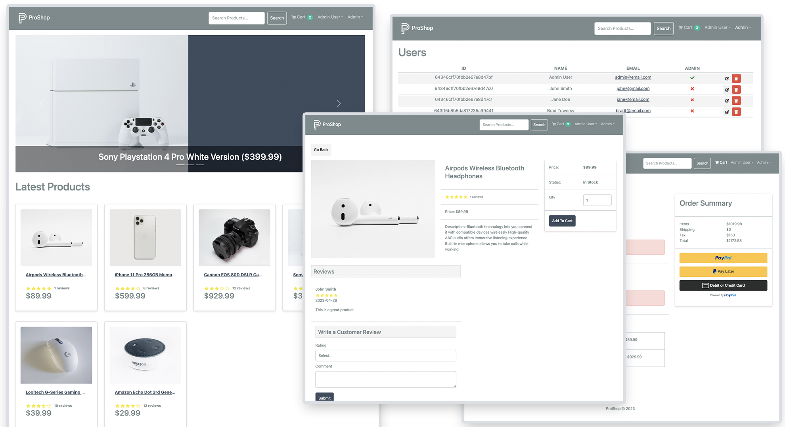

# ProShop eCommerce Platform (v2)

> eCommerce platform built with the MERN stack & Redux.



This project is part of my [MERN Stack From Scratch | eCommerce Platform](https://www.traversymedia.com/mern-stack-from-scratch) course. It is a full-featured shopping cart with PayPal & credit/debit payments. See it in action at https://www.proshopdemo.dev

This is version 2.0 of the app, which uses Redux Toolkit. The first version can be found [here](https://proshopdev.dev)

## Features

- Full featured shopping cart
- Product reviews and ratings
- Top products carousel
- Product pagination
- Product search feature
- User profile with orders
- Admin product management
- Admin user management
- Admin Order details page
- Mark orders as delivered option
- Checkout process (shipping, payment method, etc)
- PayPal / credit card integration
- Database seeder (products & users)

## Usage

- Create a MongoDB database and obtain your `MongoDB URI` - [MongoDB Atlas](https://www.mongodb.com/cloud/atlas/register)
- Create a PayPal account and obtain your `Client ID` - [PayPal Developer](https://developer.paypal.com/)

### Env Variables

Rename the `.env.example` file to `.env` and add the following

```
NODE_ENV = development
PORT = 5000
MONGO_URI = your mongodb uri
JWT_SECRET = 'abc123'
PAYPAL_CLIENT_ID = your paypal client id
PAGINATION_LIMIT = 8
```

Change the JWT_SECRET and PAGINATION_LIMIT to what you want

### Install Dependencies (frontend & backend)

```
npm install
cd frontend
npm install
```

### Run

```

# Run frontend (:3000) & backend (:5000)
npm run dev

# Run backend only
npm run server
```

## Build & Deploy

```
# Create frontend prod build
cd frontend
npm run build
```

### Seed Database

You can use the following commands to seed the database with some sample users and products as well as destroy all data

```
# Import data
npm run data:import

# Destroy data
npm run data:destroy
```

```
Sample User Logins

admin@email.com (Admin)
123456

john@email.com (Customer)
123456

jane@email.com (Customer)
123456
```

## License

The MIT License

Copyright (c) 2020 Traversy Media https://traversymedia.com

Permission is hereby granted, free of charge, to any person obtaining a copy
of this software and associated documentation files (the "Software"), to deal
in the Software without restriction, including without limitation the rights
to use, copy, modify, merge, publish, distribute, sublicense, and/or sell
copies of the Software, and to permit persons to whom the Software is
furnished to do so, subject to the following conditions:

The above copyright notice and this permission notice shall be included in
all copies or substantial portions of the Software.

THE SOFTWARE IS PROVIDED "AS IS", WITHOUT WARRANTY OF ANY KIND, EXPRESS OR
IMPLIED, INCLUDING BUT NOT LIMITED TO THE WARRANTIES OF MERCHANTABILITY,
FITNESS FOR A PARTICULAR PURPOSE AND NONINFRINGEMENT. IN NO EVENT SHALL THE
AUTHORS OR COPYRIGHT HOLDERS BE LIABLE FOR ANY CLAIM, DAMAGES OR OTHER
LIABILITY, WHETHER IN AN ACTION OF CONTRACT, TORT OR OTHERWISE, ARISING FROM,
OUT OF OR IN CONNECTION WITH THE SOFTWARE OR THE USE OR OTHER DEALINGS IN
THE SOFTWARE.
